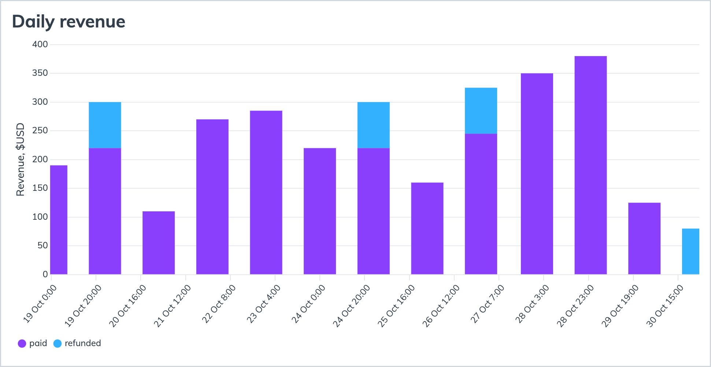

# Portfolio Project: Data Analysis with SQL - Startup Analysis

In this project, I conduct an in-depth analysis of startup data to uncover key insights that drive decision-making for investors, founders, and stakeholders. Using SQL, I explore a variety of datasets that cover aspects of startup performance, such as funding rounds, investor details, startup demographics, industry trends, and revenue growth over time. The project demonstrates proficiency in SQL querying, data cleaning, aggregation, and visualization, focusing on essential metrics that define startup success and industry potential.

## Revenue analysis

  

  This is a chart with successful and refunded purchases from the past 14 days.

 
 

## User analysis

  

  Number of users who came organically vs via marketing campaigns.

 
 

Now we're back to free flowing text.
