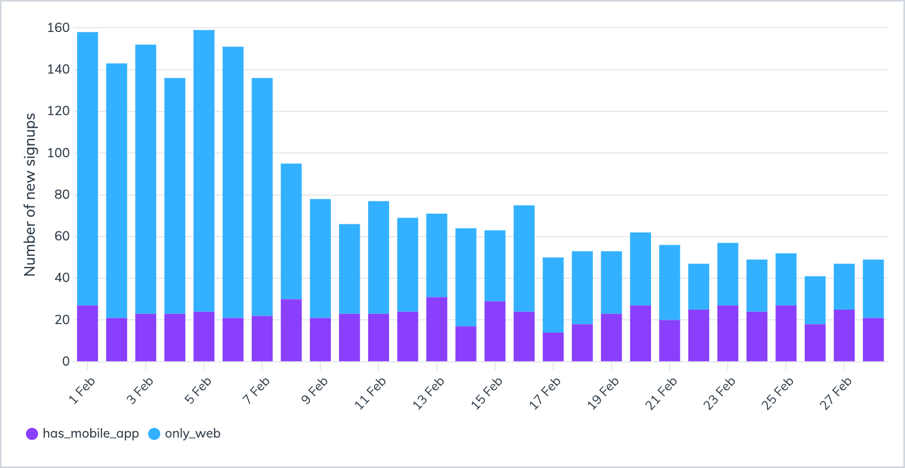
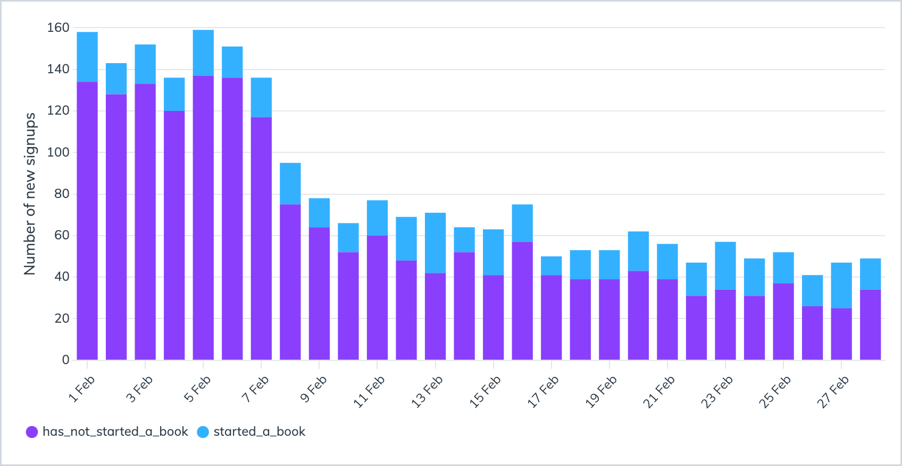
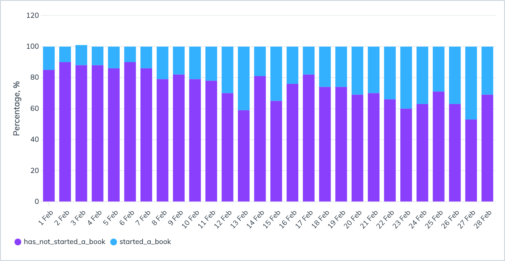

Hi :wave: My name is Anatoli and this is a template for a portfolio project on <a href="https://www.sqlhabit.com">SQL Habit</a>. It has a collection of dashboards for a fictional startup named Bindle, a subscription-based book service.

 

### Table of Contents
- [AARRR metrics for a subscription-based book app](#aarrr-metrics-for-a-subscription-based-book-app)
  - [Acquisition](#acquisition)
    - [Daily signups](#daily-signups)
    - [Daily organic vs paid signups](#daily-organic-vs-paid-signups)
    - [Biggest marketing channels](#biggest-marketing-channels)
  - [Activation](#activation)
    - [Soft-activation: users with mobile app](#soft-activation-users-with-mobile-app)
    - [Hard-activation: users who read a book](#hard-activation-users-who-read-a-book)

# AARRR metrics for a subscription-based book app

AARRR is a collection of metrics to measure any business:

* Acquisition
* Activation
* Retention
* Revenue
* Referral

:iphone: In this project, I'm working with a data warehouse of a fictional startup named Bindle. Bindle has a mobile and a web apps for reading books. It charges users monthly or yearly subscription fee.

:bar_chart: In the project, we'll build charts with basic AARRR metrics for Bindle.

## Acquisition

Let's see how many users sign up for Bindle daily, where they are coming from, what are the biggest acquisition channels are on web and mobile.

### Daily signups

Although the absolute number of signups might seem a vanity metric, it's nice to visualize it and track our day-to-day growth trends.

Here's the query behind this dashboard:

~~~pgsql
SELECT
  created_at::date AS d,
  COUNT(*) AS user_count
FROM users
WHERE
  -- from now on we'll use this date filter instead of
  -- now() - '30 days'::interval because the dataset
  -- is from 2018
  date_part('year', created_at) = 2018
  AND date_part('month', created_at) = 2
GROUP BY 1
ORDER BY 1 DESC
~~~

A number of new user accounts created per day for the past 30 days.

 
 

### Daily organic vs paid signups

Let's transform the absolute-number vanity metric into something more actionable. What drives our growth? Let's see the ratio between organic signups and users we acquired through marketing campaigns:

~~~pgsql
SELECT
  created_at::date AS d,
  CASE WHEN utm_medium IS NULL THEN 'organic' ELSE 'paid' END AS user_source,
  COUNT(*) AS user_count
FROM users
WHERE
  date_part('year', created_at) = 2018
  AND date_part('month', created_at) = 2
GROUP BY 1, 2
ORDER BY 1 DESC
~~~

A number of new organic and paid user accounts created per day for the past 30 days.

 
 

### Biggest marketing channels

Let's zoom into paid signups and see which channels and campaigns drive our growth.

~~~pgsql
SELECT
  utm_source,
  utm_campaign,
  utm_content,
  COUNT(*) AS user_count
FROM users
WHERE
  date_part('year', created_at) = 2018
  AND date_part('month', created_at) = 2
  AND utm_medium IS NOT NULL
GROUP BY 1, 2, 3
ORDER BY 4 DESC
~~~

As you can see, Twitter and Facebook are our primary paid CPC marketing channels.

 
 

## Activation

Now we've glimpsed into the user numbers, let's see what happens with these users down the funnel.

### Soft-activation: users with mobile app

Let's see how many users who signed up on the web installed a mobile app. Here and later we'll use daily cohorts based on user signup date.

~~~pgsql
WITH mobile_app_users AS (
  SELECT DISTINCT user_id
  FROM mobile_analytics.events m
)

SELECT
  u.created_at::date AS d,
  CASE WHEN m.user_id IS NOT NULL THEN 'has_mobile_app' ELSE 'only_web' END AS mobile_app_status,
  COUNT(u.id) AS user_count
FROM users u
LEFT JOIN mobile_app_users m
  ON u.id = m.user_id
WHERE
  date_part('year', u.created_at) = 2018
  AND date_part('month', u.created_at) = 2
GROUP BY 1, 2
ORDER BY 1 DESC
~~~

Let's see what portion of users who signed up via the website installed our mobile app.

> [!NOTE]
> Even if new users haven't read a book yet, we may reach them later in the mobile app via a push notification or an in-app message.

 
 

### Hard-activation: users who read a book

By definition, the hard-activation is when users do the primary action of our app – read books. Let's see what percentage of users actually read books.

~~~pgsql
SELECT
  u.created_at::date AS d,
  CASE WHEN b.user_id IS NOT NULL THEN 'started_a_book' ELSE 'has_not_started_a_book' END AS hard_activation_status,
  COUNT(DISTINCT(u.id)) AS user_count
FROM users u
LEFT JOIN books_users b
  ON u.id = b.user_id
WHERE
  date_part('year', u.created_at) = 2018
  AND date_part('month', u.created_at) = 2
GROUP BY 1, 2
ORDER BY 1 DESC
~~~

Let's see the portion of web signups who actually did what they came for and started reading a book.

 
 

If we were to start improving the hard-activation rate, let's make sure we can reliably measure it. We'd want to increase a portion of users who started reading books, so let's rebuild the last chart :point_up: and show hard activation rate in percentages:

~~~pgsql
WITH hard_activation_stats AS (
  SELECT
    u.created_at::date AS d,
    CASE WHEN b.user_id IS NOT NULL THEN 'started_a_book' ELSE 'has_not_started_a_book' END AS hard_activation_status,
    COUNT(DISTINCT(u.id)) AS user_count
  FROM users u
  LEFT JOIN books_users b
    ON u.id = b.user_id
  WHERE
    date_part('year', u.created_at) = 2018
    AND date_part('month', u.created_at) = 2
  GROUP BY 1, 2
  ORDER BY 1 DESC
)

SELECT
  d,
  hard_activation_status,
  ROUND(100.0 * user_count / SUM(user_count) OVER (PARTITION BY d, hard_activation_stats)) AS pct
FROM hard_activation_stats
ORDER BY d DESC
~~~

We can use this chart to measure if our efforts (improving onboarding, book recommendations, etc) lead to a bigger hard activation rate.

 
 
