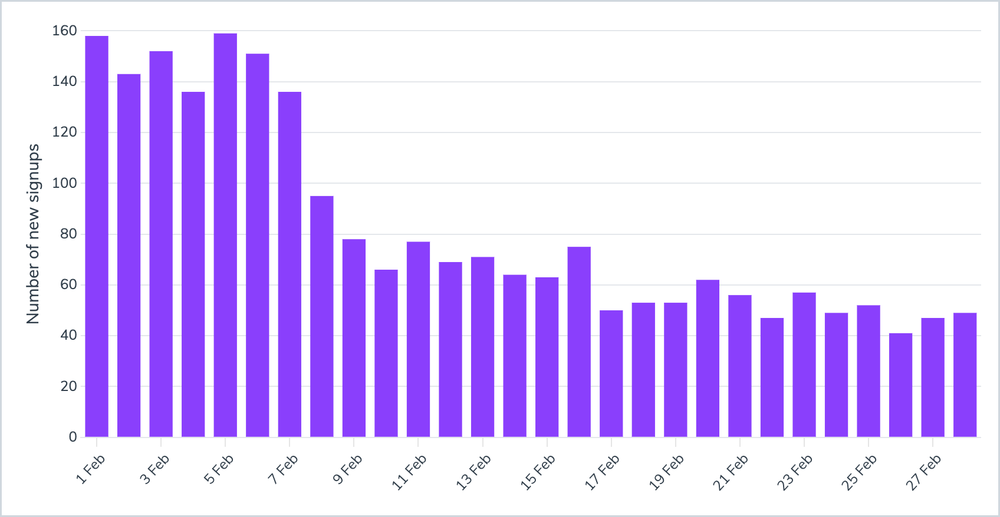
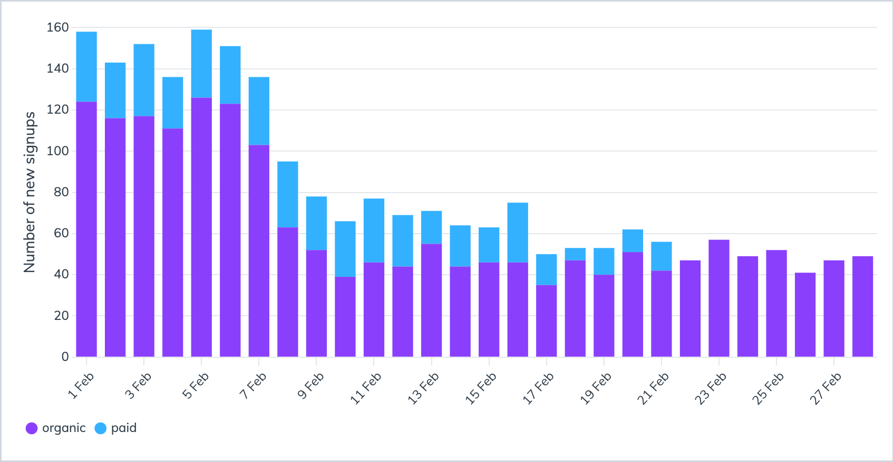
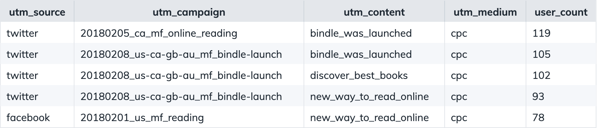
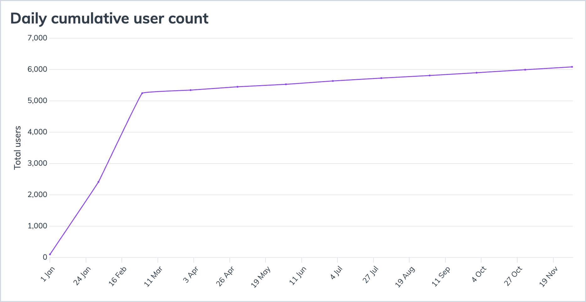
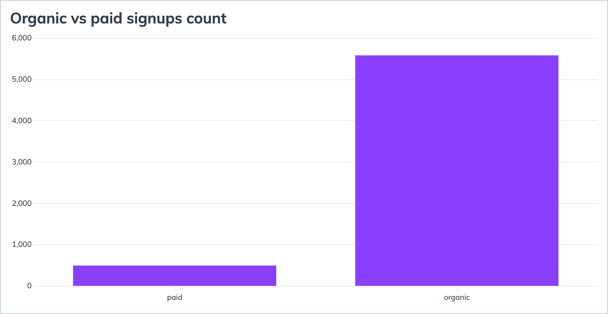
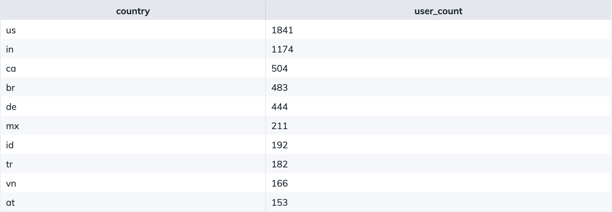

Hi :wave: My name is Anatoli and this is a template for a portfolio project on <a href="https://www.sqlhabit.com">SQL Habit</a>. It has a collection of dashboards for a fictional startup named Bindle, a subscription-based book service.

 

- [AARRR metrics for a subscription-based book app](#aarrr-metrics-for-a-subscription-based-book-app)
  - [Acquisition](#acquisition)
    - [Daily signups](#daily-signups)
    - [Daily organic vs paid signups](#daily-organic-vs-paid-signups)
    - [Biggest marketing channels](#biggest-marketing-channels)
  - [User analysis](#user-analysis)
    - [Total number of users](#total-number-of-users)
    - [Where users come from?](#where-users-come-from)

# AARRR metrics for a subscription-based book app

AARRR is a collection of metrics to measure any business:

* Acquisition
* Activation
* Retention
* Revenue
* Referral

:iphone: In this project, I'm working with a data warehouse of a fictional startup named Bindle. Bindle has a mobile and a web apps for reading books. It charges users monthly or yearly subscription fee.

:bar_chart: In the project, we'll build charts with basic AARRR metrics for Bindle.

## Acquisition

Let's see how many users sign up for Bindle daily, where they are coming from, what are the biggest acquisition channels are on web and mobile.

### Daily signups

Although the absolute number of signups might seem a vanity metric, it's nice to visualize it and track our day-to-day growth trends.

Here's the query behind this dashboard:

~~~pgsql
SELECT
  created_at::date AS d,
  COUNT(*) AS user_count
FROM users
WHERE
  created_at > now() - '1 month'::interval
GROUP BY 1
ORDER BY 1 DESC
~~~

  

  A number of new user accounts created per day for the past 30 days.

 
 

### Daily organic vs paid signups

Let's transform the absolute-number vanity metric into something more actionable. What drives our growth? Let's see the ratio between organic signups and users we acquired through marketing campaigns:

~~~pgsql
SELECT
  created_at::date AS d,
  CASE WHEN utm_medium IS NULL THEN 'organic' ELSE 'paid' END AS user_source,
  COUNT(*) AS user_count
FROM users
WHERE
  date_part('year', created_at) = 2018
  AND date_part('month', created_at) = 2
GROUP BY 1, 2
ORDER BY 1 DESC
~~~

  

  A number of new organic and paid user accounts created per day for the past 30 days.

 
 

### Biggest marketing channels

Let's zoom into paid signups and see which channels and campaigns drive our growth.

~~~pgsql
SELECT
  utm_source,
  utm_campaign,
  utm_content,
  COUNT(*) AS user_count
FROM users
WHERE
  date_part('year', created_at) = 2018
  AND date_part('month', created_at) = 2
  AND utm_medium IS NOT NULL
GROUP BY 1, 2, 3
ORDER BY 4 DESC
~~~

  

  As you can see, Twitter and Facebook are our primary paid CPC marketing channels.

 
 

## User analysis

### Total number of users

  

  Let's look at total number of users daily.

 
 

> [!TIP]
> It's a good dashboard to display on a TV in the office. 😉

### Where users come from?

  

  Number of users who came organically vs via marketing campaigns.

 
 

  

  TOP-10 countries with their respective number of users.

 
 

Now we're back to free flowing text.
